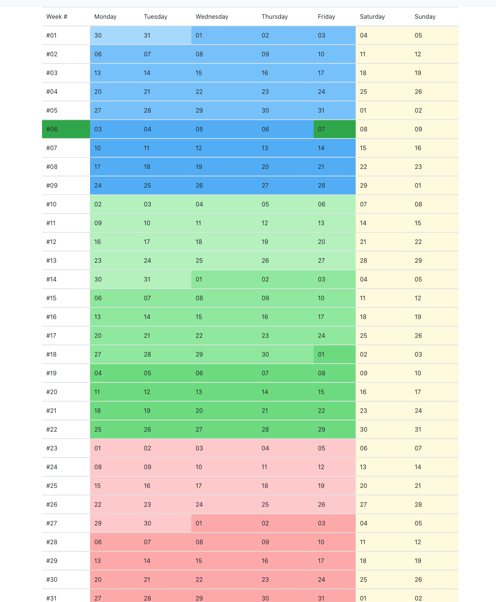

# year-week-day

It's typical for humans to specify date as year-month-day or combinations of these three parts. For me it's easier to see the year as a single table split per weeks.

This is an experiment to render the year per weeks. It allows you to drag-select some days or weeks and specify a label. For me it helps to plan the year.

<a href="https://spidgorny.github.io/year-week-day/">
    Try Now
</a>

